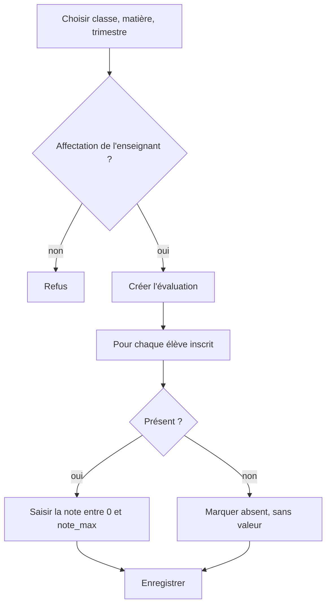

# Analyse fonctionnelle — cahier de notes

Application de saisie, de gestion, de consultation et d'analyse des notes d'un collège. Le périmètre est volontairement limité à ce qui sert le bulletin et les statistiques de classe. Les absences de cours, le cahier de textes, l'emploi du temps et l'espace familles sont hors périmètre.

Le jeu de démonstration décrit un collège (6e à 3e). Le modèle accepte d'autres niveaux : ce n'est pas une limite du schéma.

## 1. Modèle fonctionnel

| Concept | Rôle |
| --- | --- |
| Établissement | L'école. Nom, adresse, téléphone, e-mail. |
| Année scolaire | Période datée (`2025-2026`), statut `PREPARATION`, `EN_COURS` ou `CLOTUREE`. |
| Niveau | 6e, 5e, 4e, 3e, avec un ordre d'affichage. |
| Classe | Une division dans une année et un niveau (`6e A`), avec un professeur principal. |
| Élève | Identité stable. Le matricule est unique et ne change pas quand l'élève change de classe. |
| Inscription | Lien élève–classe pour une année. Au plus une inscription par élève et par année. |
| Enseignant | Identité professionnelle, e-mail, téléphone, statut actif ou inactif. |
| Matière | Code, nom, coefficient de moyenne générale. Le niveau est optionnel : vide signifie « tous les niveaux ». |
| Affectation | Un enseignant enseigne une matière dans une classe, pour une année. |
| Période | Trimestre 1, 2 ou 3, daté, inclus dans l'année. |
| Évaluation | Devoir, interrogation ou composition. Matière, classe, enseignant, période, date, note maximale, coefficient. |
| Note | Résultat d'un élève à une évaluation, ou absence à cette évaluation, avec un commentaire facultatif. |
| Bulletin | Document calculé, non stocké, pour une période ou pour l'année. |
| Utilisateur | Compte de connexion, mot de passe haché, un rôle, lien optionnel vers un enseignant. |
| Rôle | `ADMIN`, `DIRECTION`, `ENSEIGNANT`, `PROFESSEUR_PRINCIPAL`, `CONSULTATION`. |

Un élève n'est pas un utilisateur. Les comptes familles ne font pas partie de cette version.

## 2. Règles de gestion

1. Un établissement possède une ou plusieurs années scolaires. Une seule année a le statut `EN_COURS`.
2. Une classe appartient à une seule année et à un seul niveau. Le nom de classe est unique dans l'année.
3. Le matricule élève est unique dans l'établissement, permanent, indépendant de la classe.
4. Un élève a au plus une inscription par année scolaire. L'année de l'inscription est celle de la classe.
5. Le parcours normal d'un départ n'est pas la suppression : le statut élève passe à `SORTI` ou `TRANSFERE`, et l'inscription suit.
6. Une matière a un code unique, un nom unique et un coefficient strictement positif. Ce coefficient sert à la moyenne générale et reste le même sur l'année.
7. Si une matière porte un niveau, elle ne peut être affectée qu'à une classe de ce niveau. Sans niveau, elle vaut pour tout le collège.
8. Une affectation relie un enseignant, une classe, une matière et une année. Une classe n'a qu'un enseignant par matière et par année. L'année de l'affectation est celle de la classe.
9. Un enseignant ne crée, ne saisit et ne modifie que les évaluations et les notes de ses affectations.
10. Le professeur principal lit toutes les matières de sa classe et les bulletins de ses élèves. Il ne saisit des notes que pour ses propres affectations.
11. Une période est un trimestre d'ordre 1, 2 ou 3. Ses dates sont incluses dans celles de l'année, et la date de fin est postérieure à la date de début.
12. Une évaluation référence la matière, la classe, l'enseignant affecté et la période. Sa date tombe dans la période. `note_max` est strictement positive et au plus 100. Le coefficient d'évaluation est strictement positif.
13. Il existe au plus une note par élève et par évaluation. Soit l'élève est absent (`valeur` nulle), soit la valeur est renseignée, supérieure ou égale à 0, et inférieure ou égale à la note maximale de l'évaluation.
14. La note ne concerne qu'un élève inscrit (statut `INSCRIT`) dans la classe de l'évaluation.
15. Une note absente est ignorée dans les moyennes. Elle ne compte ni comme zéro ni dans le dénominateur.
16. La moyenne de matière ramène chaque note sur 20, puis pondère par les coefficients d'évaluation.
17. La moyenne générale pondère les moyennes de matières par les coefficients de matières. Une matière sans moyenne est écartée, coefficient compris.
18. Le rang est un rang concours sur la moyenne générale, dans la classe. Deux moyennes égales partagent le rang et le suivant est sauté. Un élève sans moyenne générale n'est pas classé.
19. L'appréciation affichée vient du barème ci-dessous. Elle n'est pas ressaisie : cela évite une deuxième source de vérité. Le commentaire libre reste celui de la note.
20. Année `CLOTUREE` : la saisie est fermée pour tout le monde sauf l'administrateur, qui peut corriger une erreur. Cette fermeture est une règle d'autorisation, pas un trigger, afin qu'une correction reste possible.
21. Les mots de passe ne sont stockés que sous forme de hash. Les cinq rôles forment une liste fermée.
22. Un compte `ENSEIGNANT` ou `PROFESSEUR_PRINCIPAL` est lié à un enseignant. Un compte `PROFESSEUR_PRINCIPAL` correspond à l'enseignant désigné professeur principal d'au moins une classe.
23. Les absences de cours (retards, demi-journées) sont hors périmètre. Seule l'absence à une évaluation est enregistrée.
24. Le bulletin est recalculé à la lecture. Il n'est pas archivé dans une table.

## 3. Règles de calcul

Le module unique est `src/lib/grading/`. Les écrans et les routes l'appelleront tous les deux.

### 3.1 Note ramenée sur 20

Les évaluations peuvent être sur 10 ou sur 20. Avant toute moyenne :

```text
note_sur_20 = valeur / note_max × 20
```

Une interrogation 8/10 devient 16/20.

### 3.2 Moyenne de matière

Pour les notes non absentes de la matière, sur la période demandée ou sur l'année :

```text
moyenne_matière = Σ (note_sur_20 × coefficient_évaluation) / Σ coefficient_évaluation
```

Exemple du cahier des charges, déjà sur 20 :

```text
(15 × 4 + 12 × 2) / (4 + 2) = 84 / 6 = 14
```

Si la deuxième note est absente, la moyenne vaut 15 : le coefficient 2 sort du dénominateur. Si toutes les notes sont absentes, la moyenne de matière est vide.

### 3.3 Moyenne générale

```text
moyenne_générale = Σ (moyenne_matière × coefficient_matière) / Σ coefficient_matière
```

Même exemple, lu cette fois avec des moyennes de matières 15 et 12 et des coefficients 4 et 2 : le résultat est 14. Une matière sans moyenne ne participe ni au numérateur ni au dénominateur.

Coefficients du collège de démonstration : Français 4, Mathématiques 4, Histoire-Géographie 3, Anglais 3, SVT 2, Physique-Chimie 2, EPS 1, Arts plastiques 1. Le total vaut 20 quand toutes les matières sont notées.

### 3.4 Arrondi

Le quotient est arrondi au centième, half-up (0,005 vers le haut), une seule fois, sur le résultat publié. Les notes intermédiaires sur 20 ne sont pas ré-arrondies avant la somme.

### 3.5 Rang

Dans la classe, on trie les moyennes générales décroissantes. La première vaut 1. Une égalité partage le rang ; le rang suivant est le nombre d'élèves déjà parcourus plus un (1, 1, 3). Les élèves sans moyenne générale restent sans rang, en fin de liste.

Le rang de période utilise les moyennes de la période. Le rang annuel utilise les moyennes de l'année.

### 3.6 Appréciation

Borne basse inclusive, sur la moyenne déjà arrondie :

| Moyenne sur 20 | Appréciation |
| --- | --- |
| à partir de 16 | Très bien |
| à partir de 14 | Bien |
| à partir de 12 | Assez bien |
| à partir de 10 | Passable |
| à partir de 8 | Insuffisant |
| en dessous de 8 | Très insuffisant |
| moyenne vide | Non noté |

Le même barème sert à la matière et à la moyenne générale.

### 3.7 Bulletin

Pour un élève et une période (ou l'année) : identité, classe, lignes de matières (moyenne, coefficient, appréciation), moyenne générale, rang, effectif de la classe. Pas de compteur d'absences de cours.

## 4. Cas d'utilisation

| Cas | Acteur | Résultat |
| --- | --- | --- |
| Ouvrir une année | Admin, direction | Année `EN_COURS`, trois trimestres datés, ancienne année close ou en préparation. |
| Tenir le référentiel | Admin | Établissement, niveaux, classes, matières, enseignants, affectations, comptes. |
| Inscrire un élève | Admin | Matricule unique, identité, inscription dans une classe de l'année. |
| Créer une évaluation | Enseignant affecté, professeur principal sur ses matières | Évaluation datée dans le trimestre, barème et coefficient fixés. |
| Saisir les notes | Même périmètre | Une ligne par élève inscrit : note ou absence, commentaire facultatif. |
| Corriger une note | Enseignant tant que l'année est ouverte ; admin y compris après clôture | La moyenne recalculée change, l'ancienne valeur n'est pas historisée dans cette version. |
| Lire une classe | Professeur principal (sa classe), direction, consultation, admin | Toutes les matières. L'enseignant simple ne voit que les siennes. |
| Lire un bulletin | Selon le même périmètre de lecture | Document calculé. |
| Analyser les résultats | Selon le périmètre de lecture | Distributions, moyennes de classe, part d'élèves sous 10, écarts entre matières. |
| Clôturer l'année | Admin, direction | Statut `CLOTUREE`, saisie fermée hors correction admin. |

## 5. Workflows

### Ouverture d'année


### Saisie d'une évaluation



### Lecture d'un bulletin


## 6. Écrans

L'interface viendra dans une phase suivante. La liste utile est celle-ci, sans écran d'emploi du temps ni de messagerie.

| Écran | Usage | Rôles |
| --- | --- | --- |
| Connexion | E-mail et mot de passe | Tous |
| Tableau de bord | Raccourcis selon le rôle, année en cours | Tous |
| Établissement | Fiche nom, adresse, contact | Admin en écriture, direction en lecture |
| Années et trimestres | Dates, statut, clôture | Admin, direction |
| Classes | Nom, niveau, professeur principal | Admin |
| Élèves | Recherche, fiche, inscription annuelle | Admin en écriture ; lecture selon périmètre |
| Enseignants | Fiche et statut | Admin |
| Matières | Code, nom, coefficient | Admin |
| Affectations | Enseignant, classe, matière, année | Admin |
| Évaluations | Liste et création dans le périmètre | Enseignant, professeur principal, admin |
| Saisie des notes | Grille des élèves d'une évaluation | Même périmètre d'écriture |
| Résultats | Moyennes, rang, filtres classe / matière / période | Lecture selon la matrice |
| Bulletin | Aperçu calculé, impression ultérieure | Lecture selon la matrice |
| Analyses | Distributions et comparaisons | Lecture selon la matrice |
| Comptes | Utilisateurs et rôles | Admin |

## 7. Matrice de permissions

Légende : écriture `E`, lecture `L`, interdit `—`. « Périmètre » signifie les classes et matières des affectations de l'enseignant lié au compte. « Sa classe » signifie les classes dont il est professeur principal.

| Action | Admin | Direction | Enseignant | Professeur principal | Consultation |
| --- | --- | --- | --- | --- | --- |
| Référentiel (établissement, matières, comptes, affectations) | E | L | — | — | — |
| Année : ouverture et clôture | E | E | — | — | L |
| Inscriptions élèves | E | L | — | L sa classe | L |
| Créer une évaluation | E | — | E périmètre | E périmètre | — |
| Saisir ou modifier une note | E | — | E périmètre | E périmètre | — |
| Lire les notes | L | L | L périmètre | L sa classe et son périmètre | L |
| Bulletin | L | L | L périmètre | L sa classe | L |
| Analyses | L | L | L périmètre | L sa classe et son périmètre | L |
| Corriger après clôture | E | — | — | — | — |

Un enseignant qui n'est pas affecté à la classe ou à la matière ne peut ni créer l'évaluation ni modifier la note, même s'il connaît l'adresse de l'écran. Le professeur principal n'obtient pas, par son rôle, le droit de saisir les notes de ses collègues : il obtient la lecture de l'ensemble de sa classe.

## 8. Hors périmètre

- Absences et retards de cours, sanctions, vie scolaire quotidienne.
- Emploi du temps, cahier de textes, devoirs à la maison hors évaluation notée.
- Comptes parents, messagerie, notifications.
- Historique d'audit des corrections (prévu avec la phase sécurité, pas dans le schéma actuel).
- Archivage figé du bulletin PDF. Le bulletin est recalculé. Un figé pourra être ajouté le jour où une année close doit rester byte à byte identique après un correctif de barème.
