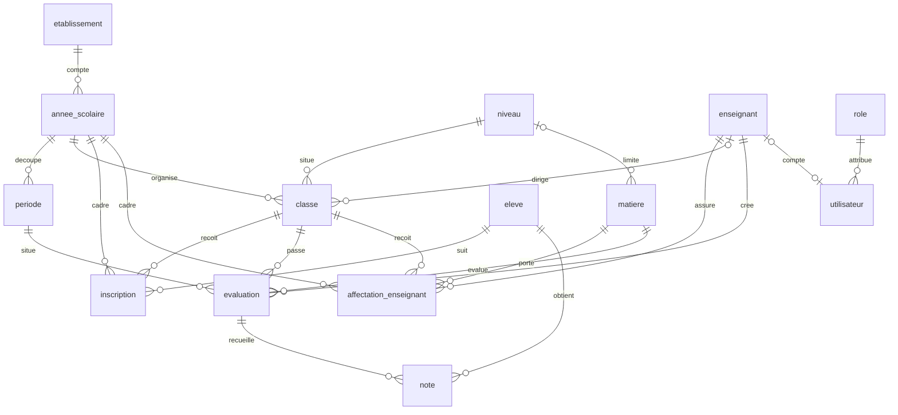

# Architecture technique — cahier de notes

Décisions figées pour les phases suivantes. Le dépôt implémente ici le socle : application Next.js, module de calcul, schéma PostgreSQL, migrations et jeu de démonstration.

## 1. Stack

| Brique | Choix |
| --- | --- |
| Interface et serveur | Next.js (App Router), TypeScript, Tailwind CSS |
| API | Route Handlers dans `src/app/api`, runtime Node.js |
| Base | PostgreSQL |
| Accès aux données | Drizzle ORM |
| Auth | Auth.js, fournisseur Credentials, session JWT |
| Graphiques | Recharts, composants client des écrans d'analyse |
| Hébergement | Vercel, base Neon (marketplace Vercel) |

Aucune file de messages, aucun cache distribué, aucun ORM supplémentaire. Recharts et Auth.js seront installés avec les écrans et la connexion : les ajouter maintenant ne servirait aucun code.

Drizzle est retenu plutôt que Prisma.
Le schéma TypeScript produit des migrations SQL lisibles, sans binaire de moteur de requêtes, ce qui reste léger dans une fonction Vercel.
Les `CHECK`, l'index partiel et les triggers restent dans le SQL versionné, au plus près de PostgreSQL, avec le même schéma comme contrat typé.

## 2. Structure du projet

```text
src/app/                  App Router, pages en français
src/app/api/              Route Handlers (phase backend)
src/lib/grading/          calcul unique, pur, sans base ni React
src/lib/auth/             session et matrice de permissions (phase auth)
src/lib/analytics/        agrégats qui appellent grading (phase analyses)
src/db/schema.ts          tables Drizzle
src/db/client.ts          connexion postgres.js
src/db/migrate.ts         migrations puis triggers
src/db/seed.ts            jeu de démonstration
src/db/demo/              construction déterministe du jeu
drizzle/                  SQL généré et triggers.sql
tests/                    calcul, jeu de données, contraintes SQL
docs/                     analyse et architecture
```

Les routes et les composants importeront `@/lib/grading`. Ils ne recopieront pas les formules.

## 3. Modèle de données

Les noms de tables sont ceux du métier. Les clés sont des UUID. Chaque table porte `created_at` et `updated_at` (trigger `set_updated_at`).



`matiere.niveau_id` est nul quand la matière vaut pour tous les niveaux. `utilisateur.enseignant_id` est nul pour l'admin, la direction et la consultation.

### Intégrité

| Règle | Mécanisme |
| --- | --- |
| Clés et liens | PK, FK |
| Matricule, note par élève et évaluation, une inscription par année, une affectation par classe–matière–année, une année `EN_COURS` | `UNIQUE` ou index unique partiel |
| Coefficients, `note_max`, dates de début et de fin, statuts, sexe, absence cohérente avec la valeur, note négative | `CHECK` |
| Note ≤ `note_max` | Trigger `note_verifier` |
| Dates de période dans l'année, date d'évaluation dans la période, affectation réelle, élève inscrit dans la classe, compte PP lié à une classe | Triggers |

`ON DELETE` : `RESTRICT` sur le référentiel (on ne détruit pas une classe qui a des évaluations), `CASCADE` sur les lignes qui n'ont pas de sens seules (note, inscription, affectation, période), `SET NULL` sur le professeur principal d'une classe et sur le lien compte–enseignant.

La note maximale n'est pas recopiée sur la note. Un `CHECK` PostgreSQL ne peut pas lire `evaluation`. Le trigger `BEFORE INSERT OR UPDATE` relit `note_max` et lève `23514` avec le message `note_depasse_maximum` si la valeur dépasse. Ainsi une correction du barème reste la source de vérité, et les tests distinguent ce cas d'un simple `CHECK` de note négative (`note_valeur_non_negative`).

La clôture d'année n'est pas un trigger. C'est une règle d'autorisation : l'admin doit pouvoir corriger une année close sans désactiver un trigger.

## 4. Auth et autorisation

Auth.js, fournisseur Credentials. Le mot de passe est vérifié avec bcrypt contre `utilisateur.mot_de_passe_hash`. La session est un JWT signé avec `AUTH_SECRET` : pas de table de session. Runtime Node.js (Fluid Compute), pas l'ancien runtime Edge.

L'autorisation vit dans un seul module, à venir : `src/lib/auth/permissions.ts`. Il applique la matrice de `docs/01-analyse-fonctionnelle.md`. Toute route d'écriture de note charge l'affectation et refuse le compte dont l'`enseignant_id` ne correspond pas, sauf l'admin. Le rôle `PROFESSEUR_PRINCIPAL` élargit la lecture à sa classe, pas l'écriture.

Les comptes sont internes à l'établissement. Pas d'OAuth dans cette version.

## 5. Calcul et analyses

`src/lib/grading/` est le module pur de calcul (`computePeriodReport`, `appreciate`, `rankCompetition`, `computeStatistics`, `compareTerms`). Ses tests sont `src/lib/grading/__tests__`, lancés par `npm test`. Le détail des formules est dans `src/lib/grading/README.md`.

Les routes d'analyses appellent ce module. Les graphiques n'afficheront que ces séries, côté client. Pas de deuxième implémentation de la pondération dans un composant ni dans une route.

## 6. Déploiement

Vercel héberge Next.js sur Fluid Compute. La base est Neon, via le marketplace Vercel : l'ancienne offre Vercel Postgres n'est plus proposée. `DATABASE_URL` pointe vers la chaîne poolée Neon en production et vers PostgreSQL local en développement.

Les migrations se lancent avant la promotion (`npm run db:migrate`), pas au démarrage d'une invocation. Le seed de démonstration ne tourne pas en production sauf décision explicite (`SEED_CONFIRM=oui`), et ses mots de passe ne sont pas des secrets réels.

Aucune clé dans le dépôt. `.env.example` documente `DATABASE_URL` et `AUTH_SECRET`. `.env` est ignoré.

Les branches de prévisualisation Neon, une par preview Vercel, pourront être branchées au moment du déploiement. Elles ne sont pas nécessaires pour le socle local.

## 7. Scripts

| Script | Effet |
| --- | --- |
| `dev`, `build`, `lint` | Application Next.js |
| `db:generate` | Nouvelle migration Drizzle à partir de `schema.ts` |
| `db:migrate` | Applique `drizzle/` puis `drizzle/triggers.sql` |
| `db:seed` | Recharge le jeu déterministe (tronque les données métier) |
| `test` | Calcul, forme du jeu, contraintes SQL |

`db:generate` ne régénère pas les triggers. Ils restent dans `drizzle/triggers.sql`, rejoués à chaque migration parce que le fichier est idempotent.
